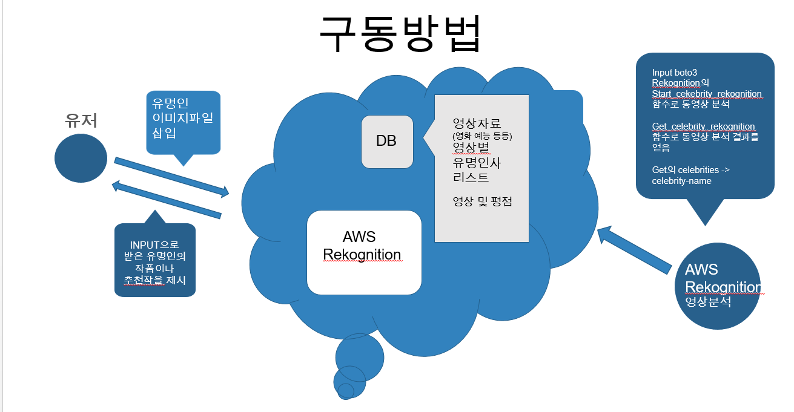
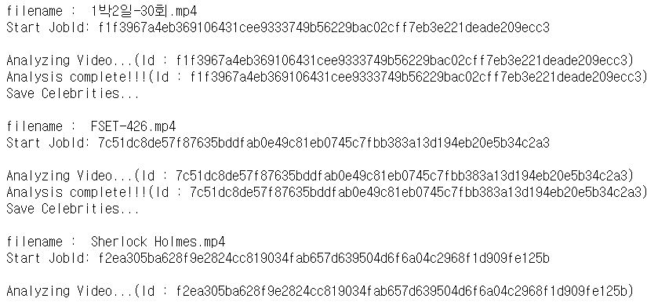

# **2020-2 클라우드 컴퓨팅 프로젝트**
## **프로젝트 명**
- 유명인의 작품 찾기
---
## **프로젝트 멤버 및 역할**
- 20185147 윤순상 : 프로그램 구현
- 20165102 강호림 : 아이디어 제안, 자료 제공
---
## **프로젝트 소개 및 개발 내용**
- 내가 좋아하는 연예인이 출연한 작품을 검색하고 그 작품들 중 추천을 받는 시스템 
---
## **프로젝트 개발 결과물 소개**

---
## **개발 결과물을 사용하는 방법 소개**
### 비디오 분석 하는 모습

### 프로그램 실행 결과

---
## **개발 결과물의 필요성 및 활용방안**
- netflix나 Youtube에서 내가 보고 싶은 유명인의 작품의 리스트를 빠르게 찾아내어 추천 받을 수 있다.
---