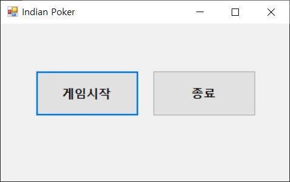
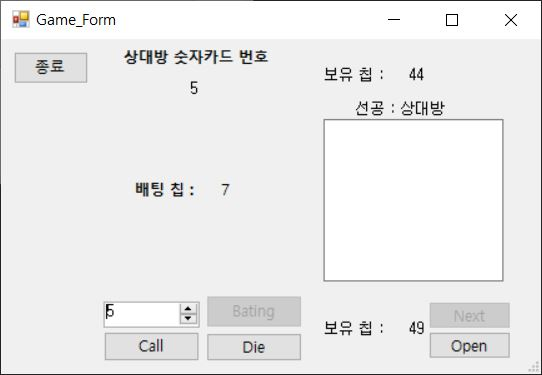

# 인디언 포커 게임 프로젝트

이 프로젝트는 처음 대학교에 들어가서 학부 1-1학기 때 처음으로 만들어본 인디언 포커 게임 프로젝트입니다. 언어로 파이썬을 사용하였습니다. 제가 더 지니어스라는 방송을 보고 인상깊게 기억하는 인디언 포커라는 게임을 모방하여 간단한 카드 게임을 만들어 보았습니다.

## 프로젝트 개요

인디언 포커는 두 명의 플레이어가 참여하여 카드를 선택하고 서로의 카드를 비교하여 승패를 가리는 간단한 게임입니다.

## 게임 규칙

1. 두 명의 플레이어가 참여합니다.
2. 각 플레이어는 1부터 10까지의 숫자 중 하나를 선택합니다.
3. 선택한 숫자가 더 큰 플레이어가 승리합니다. 단, 10은 가장 작은 숫자로 간주됩니다.

## 코드 내용

게임 실행 파일은 `main.py` 파일 입니다. 코드가 실행되면 게임을 설명하는 `game_explain.py` 코드가 먼저 실행되고 게임이 진행됩니다. 랜덤 함수에 의해서 카드가 선택되고 카드가 모두 소진되면 다시 `cnt_list`를 초기화하고 계속 진행됩니다. 칩의 갯수가 0이 된 상태에서 지면 끝입니다.

```python
import random
import game_explain
game_explain.game()
confirm = True
while confirm :
    cnt_list = [0, 0, 0, 0, 0, 0, 0, 0, 0, 0] #카드 카운팅 리스트
    com_chip = 50 #플레이어1의 시작칩 개수
    user_chip = 50 #플레이어2의 시작칩 개수
    while True :
        bating = 0 #전체 배팅 칩 개수
        cnt = 0 #리셔플 판단 변수
        if com_chip <= 0 :
            print("\n플레이어 칩 개수 :", user_chip, "\t상대방 칩 개수 :", com_chip)
            print("상대방의 칩이 0개 이므로 플레이어의 승리입니다.")
            confirm = False
            break
        elif user_chip <= 0 :
            print("\n플레이어 칩 개수 :", user_chip, "\t상대방 칩 개수 :", com_chip)
            print("플레이어의 칩이 0개 이므로 상대방의 승리입니다.")
            confirm = False
            break
        for i in range(0, 10) :
            if cnt_list[i] == 2 :
                cnt += 1
        if cnt == 10 :
            print("카드를 전부다 소모했습니다. 새로운 카드로 이어서 게임을 진행하겠습니다.")
            for i in range(0, 10) :
                cnt_list[i] = 0
            continue
        #상대방 카드설정
        com_card = random.randint(1, 10)
        if cnt_list[com_card-1] == 2 :
            continue
        cnt_list[com_card-1] += 1
        #플레이어 카드설정
        user_card = random.randint(1, 10)
        if cnt_list[user_card-1] == 2 :
            continue
        cnt_list[user_card-1] += 1
        print("\n상대방 카드 :", com_card, "\t플레이어 칩 개수 :", user_chip, "\t상대방 칩 개수 :", com_chip)
        user_bating = int(input("배팅할 칩 개수를 입력하세요. : "))
        user_chip -= user_bating
        bating += user_bating
        act = random.randint(0, 3)
        if act == 0 : #컴퓨터가 콜만 했을 때
            com_bating = user_bating
            bating += com_bating
            com_chip -= com_bating
            print("\n상대방이 콜을 했고 추가 배팅은 없습니다.")
            print("배팅 칩 개수 :", bating, "\t플레이어 칩 개수 :", user_chip, "\t상대방 칩 개수 :", com_chip)
            print("\n카드를 오픈합니다.")
            print("플레이어 카드 :", user_card, "\t상대방 카드 :", com_card)
            if com_card > user_card :
                print("상대방의 승리입니다.")
                com_chip += bating
            elif user_card > com_card :
                print("플레이어의 승리입니다.")
                user_chip += bating
            else :
                print("무승부 입니다.")
                com_chip += com_bating
                user_chip += user_bating
        elif act == 1 : #컴퓨터가 추가 배팅 했을 때
            com_bating = user_bating + random.randint(1, 5)
            bating += com_bating
            com_chip -= com_bating
            print("\n상대방이 콜을 하고  추가 배팅을 했습니다. 콜 하시겠습니까?(0 : 콜, 1 : 추가 배팅, 2 : 포기)")
            print("배팅 칩 개수 :", bating, "\t플레이어 칩 개수 :", user_chip, "\t상대방 칩 개수 :", com_chip)
            user_act = int(input("입력 : "))
            if user_act == 0 : #플레이어가 콜 했을 때
                bating += com_bating
                user_chip -= com_bating
                print("\n플레이어가 콜을 했습니다.")
                print("배팅 칩 개수 :", bating, "\t플레이어 칩 개수 :", user_chip, "\t상대방 칩 개수 :", com_chip)
                print("\n카드를 오픈 합니다.")
                print("플레이어 카드 :", user_card, "\t상대방 카드 :", com_card)
                if com_card > user_card :
                    print("상대방의 승리입니다.")
                    com_chip += bating
                elif user_card > com_card :
                    print("플레이어의 승리입니다.")
                    user_chip += bating
                else :
                    print("무승부 입니다.")
                    com_chip += com_bating
                    user_chip += user_bating + com_bating
            elif user_act == 1 : #플레이어가 추가 배팅을 했을 때
                print("\n추가 배팅 선택 했습니다. ")
                add = int(input("추가 칩 개수 : "))
                bating += com_bating + add
                user_chip -= com_bating + add
                bating += add
                com_chip -= add
                print("상대방이 추가 배팅에 콜을 했습니다.")
                print("배팅 칩 개수 :", bating, "\t플레이어 칩 개수 :", user_chip, "\t상대방 칩 개수 :", com_chip)
                print("\n카드를 오픈합니다.")
                print("플레이어 카드 :", user_card, "\t상대방 카드 :", com_card)
                if com_card > user_card :
                    print("상대방의 승리입니다.")
                    com_chip += bating
                elif user_card > com_card :
                    print("플레이어의 승리입니다.")
                    user_chip += bating
                else :
                    print("무승부 입니다.")
                    com_chip += com_bating
                    user_chip += user_bating
            else : #플레이어가 포기 했을 때
                print("\n플레이어가 포기를 선언했습니다.")
                print("플레이어 카드 :", user_card, "\t상대방 카드 :", com_card)
                com_chip += bating
                if user_card == 10 :
                    print("플레이어가 숫자 10을 가지고 포기했습니다. 따라서 칩 10개를 지불합니다.")
                    com_chip += 10
                    user_chip -= 10
        else : #컴퓨터가 포기 했을 때
            print("\n상대방이 포기를 선언했습니다.")
            print("플레이어 카드 :", user_card, "\t상대방 카드 :", com_card)
            user_chip += bating
            if com_card == 10 :
                print("상대방이 숫자 10을 가지고 포기했습니다. 따라서 칩을 추가로 10개 받습니다.")
                user_chip += 10
                com_chip -= 10
```
## 추가적인 발전

이 프로젝트는 2년 후 3학년 때 C#을 배워 윈도우 프로그래밍을 배운 내용을 활용하여 UI를 제공하는 하나의 게임 프로그램으로 발전시켜 보았습니다.


**[소스코드](Game_Form.cs)**