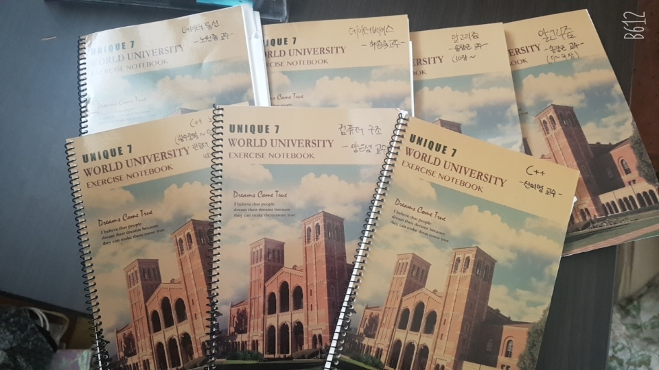
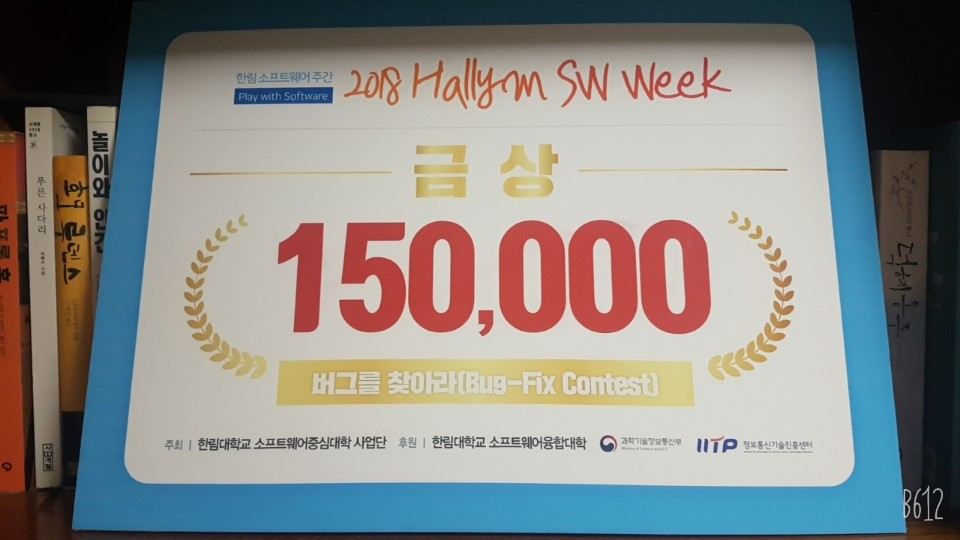

# **이력서**
## **소개**

- 이름 : 윤순상
- 나이 : 98년생 23세 (만 22세)
- 소속 : 한림대 소프트웨어융합대학 소속
- 전공 : 빅데이터 (3학년 2학기 재학 중)
- 취미 : 온라인게임, 게임관련 뉴스 보기, 컴퓨터 이론 공부
- 장래희망 : 온라인 게임 개발자, 클라우드 컴퓨팅 전문가
- Email
    - tnstkd8@naver.com
    - tnstkd98@gmail.com
---
## **컴퓨터 이론 공부**

지금까지 학교를 다니면서 배운 과목들의 이론을 정리한 노트들이다.

코딩능력은 떨어져도 수업시간에 배운 내용을 정리하고 개념을 잡기 위해 노력한 산출물이다.

하지만 지금은 교수님의 조언이 크게 와닿는다.
> 이렇게 정리할 시간에 하나라도 더 코딩하고 프로그래밍을 해봐라. 너는 나중에 벽을 느낄꺼야.

지금 3학년인 나에게 정말 딱 들어맞는 상황같아 마음이 아프다. 그래도 정리한 이 노트들 덕분에 중간중간 꺼내서 까먹은 부분, Tip이 되고 유용한 짧은 코드들이 있어 도움이 되곤 한다. 그래서 나의 유일한 장점이라고 생각한다.

---
## **수상경력**

- 2018 Hallym SW Week Bug-fix 금상
> 나의 유일한 수상경력

> 호기심에 해봤는데 금상 받아버린 대회

> 언어 : Java
### **설명**
당시 2018년 가을 나는 그 해 입학한 신입생이었다. 
갑자기 2학기가 시작되니 한림대학교가 SW 중심대학에 선정되어 여러 지원을 받게 되었다고 한다.

그래서 학교는 SW관련 여러 대회와 행사를 진행했다. 
그 중 하나가 SW Week인데 그 때 열린 대회 중 하나가 Bug-fix였다.

이것은 1, 2학년 대상으로 열린 대회였고 언어는 Java였다. 제시된 소스코드에서 버그를 찾는 대회였다. 
나는 교수님께서 "지금 배우는 Java로 진행되고 범위도 1학년에 맞춘다"고 하셔서 호기심에 "한번 해볼까?"라는 마인드로 참여하였다.

이론에 충실해서 그런지 어느정도 코드에 문제점을 찾아 수정할 수 있었다. 결과는 금상... 내가 1등을 했다. 
인생살면서 처음으로 이런 경험을 하고 상도 받고 상금도 받으니 뭔가 마음이 많이 복잡했었다.

어린마음에 15만원에 눈이 돌아갈 만큼 기분이 좋았었다. 하지만 지금 생각해보면 너무 작고 큰 의미가 있었던 것 같진 않다. 당시 상금 언제 들어오냐고 사업단 부서 누나를 들들 볶았던 기억이 나는데 지금 생각하면 정말 부끄럽고 죄송하다.

하지만 이를 계기로 학업에 더 집중하고 SW분야에 대한 열정을 가질 수 있었다.

---
## **포토폴리오**
### **< 프로그래머가 되고 싶은 이유 >**

내가 컴퓨터에 처음 입문하게 된 계기는 5살~6살때 집에 있는 컴퓨터에 설치된 스타크래프트라는 게임을 접할 때였다.
    
그 때 처음으로 컴퓨터에 손대고 게임을 했던 기억이 있다. 정말 재밌고 시간가는 줄 몰랐었다. 덕분에 나는 사람보단 컴퓨터와 더 친하게 지내게 되었다. 이후 많은 온라인 게임을 했다. 네오다크세이버, 열혈강호, 바람의 나라, 메이플스토리, 던전앤파이터, 노바1492, 바우트, 서든어택, 워크래프트3, 리그오브레전드 등 수많은 PC 온라인 게임을 즐겼다.

이후 Steam이라는 게임 플랫폼을 알게되고 나서 게임세계가 정말 흥미롭다고 느끼게 되었다. 그곳에서 여러 인디게임들을 구매해 플레이 하면서 나도 이런 게임을 만들어 한번 내놔볼까 하는 생각도 많이 들었다.

하지만 나는 청소년 시절 학업에 충실하지 못했다. 그저 게임만 하는 괴물이었다. 그러나 그런 나에게 위기가 찾아왔다. 수능을 망치고 미래에 대해 생각했다. 내 꿈은 뭘까? 뭘 하고 먹고 살지?

그 때 비로소 나는 프로그래머가 되어야 한다는 생각이 들었다. 그래서 컴퓨터공학과에 가고 싶다고 생각했다. 하지만 성적은 바닥... 어쩔 수 없이 부모님께 재수한번 하게 해달라고 부탁했고 결국 밑바닥부터 공부해서 그 결과 한림대학교 컴퓨터공학과에 18학번으로 입학하게 되었다.

---
### **< 나의 첫 미니 프로젝트 >**
[미니 프로젝트](Indian_Poker-Project)
---
#### **설명**
 내가 학교에서 처음 배운 언어는 Java와 Python이었다. 그 중 python을 사용해서 했던 인생 첫 미니 프로젝트가 바로 인디언 포커다.

 당시 나는 스타크래프트 유즈맵을 많이 했었는데 그 중 하나가 포커 디펜스였다. 그리고 더 지니어스라는 tvn예능에 나오는 모든 게임을 한번 프로그램으로 구현하고 싶다는 야망 같은 것이 있었다.

 이 때 가장 힘들었던 것이 상대방이 내가 보유하고 있는 chip보다 더 많은 chip을 배팅했을 때 자동 올인이 되는 경우였다. 하지만 이 부분을 결국 구현해내지 못했다. 그 때 짜증나고 화가 나서 정말 우울했다. 그래서 어쩔 수 없이 미완성 형태로 프로젝트를 마감했었다. 😡😭

 지금 보면 배팅을 하는 경우의 수에도 하자가 있지만 프로젝트를 끝냈을 때 나름 뿌듯했던 기억이 있다. 뭔가 내가 컴퓨터공학을 전공하면서 하나의 결과물을 낸 것 같은 기분, 게임 개발자가 된 것 같은 기분이었다.😚

 나중에 이 코드는 3학년때 윈도우프로그래밍 과목의 기말 프로젝트에 사용되어 아주 조금 발전시켜본 경험이 있습니다.
---
### **< 암흑의 2학년 >**
지금 생각하면 왜 그렇게 생활했나 싶기도 하다. 나는 장거리 통학을 하는 학우였기에 상당히 피곤한 대학생활을 보냈다. 

그래서 2년째 되는 해에 현자타임이라는 것이 오기 시작했다. "왜 이렇게 사는거지? 공부하기 싫다"라는 생각만이 가득찼다. 기숙사를 하거나 자취를 하면 나아질 것이라 생각했지만 집안 형편이 많이 좋지 않은 편이라 그 짐을 부모님께 부담시키고 싶지 않았다.

대출을 해서 빚을 지고 싶지도 않았기 때문에 이악물고 통학을 했고 장학금을 타면서 학비를 매우 조금 내면서 다녔다. 다른 사람들은 대단하다고 하지만 나는 몹시 지쳐있었다. 그래서 뭔가 멍하니 그저 수업을 듣고 과제를 하고... 그렇게 2학년을 지냈다. 

뭔가 자기개발이나 1학년 때 했던 인디언 포커같은 프로젝트를 이어가야 했는데 그럴 생각도 들지 않았던 것 같다. 그 때문인지 1학기 성적이 4점대가 안되서 장학금을 받지 못하는 상황도 발생했었다.

이 상황을 극복하기 위해 여러 명의 교수님께 상담을 받았고 그 결과 일단 열심히 하자는 마인드를 가지고 학교를 다니게 되었다. 

> 뭐가 뭔지 모르겠지만 일단 하자. 미래의 나 자신을 위해... 그 때 더 좋은 선택과 결정을 할 수 있도록!

이런 마인드를 가지고 하니 전부는 아니어도 어느정도 학교를 다닐 수 있었고 다행히 2학기는 4학점대를 유지하면서 좋게 마무리 할 수 있었다.

덕분에 3학년에 성적장학금도 받고 사업단 장학금까지 받아 학비를 내지 않고 다닐 수 있게 되었고 전공책도 마음편히 살 수 있었다. 다시 생각해도 2학년은 지옥같았다. 그래도 잘 극복해 나가서 다행이다.😄

---
### **< 처음으로 게임제작에 입문하다 >**
3학년이 된 지금 게임개발자라는 꿈에 한 걸음 다가가게 되었다. 드디어 게임제작기초 강의를 듣게 되었다. 2학년때 수강을 실패했는데 드디어 게임제작을 배울 수 있는 기회가 생겼다. 

심지어 수업에 사용될 Tool이 Unity3D엔진이다. 나는 이미 Unity에 대해 관심을 가지고 있었고 툴을 설치해 아주 조금 체험을 해봤던 적이 있었다. 그 이유는 내가 참여했던 Unity Unite Seoul 2019 때문이다.

이 행사는 Unity엔진에 대한 새로운 소식, 그에 대한 Unity연구원들의 특강, 현업에서 일하는 게임 개발자들의 특강 그리고 Unity시스템을 체험할 수 있는 행사다. 입장권을 싸게 구할 방법이 생겨 참여하게 되었는데 이 때부터 Unity에 관심을 가졌고 Unity유튜브를 통해 조금씩 체험을 해나가고 있었다.

지금 재밌게 수강하고 있고 최근에 수업에서 완성한 닷지 게임이 정말 재밌고 어려워서 기분이 좋다. 뭔가 게임개발자라는 꿈에 한걸음 더 나아가는 기분이다.
---
### **< 클라우드! 새로운 분야에 꿈을 가지게 되다. >**
 나의 취미는 IT관련 뉴스를 가끔 찾아 보는 것이다. 그 중 대부분 게임과 관련된 뉴스를 찾아 본다. 

 보통 유튜브의 영상을 많이 보는 편인데, 2019년 어느날 내가 좋아하는 전직 게임 개발자인 유튜버가 한 영상을 올렸다. 그것이 바로 구글의 스태디아에 대한 것이였다. 
 
 
 그전까지는 간접적으로 클라우드 서비스(네이버 클라우드, 구글클라우드 등의 서비스)를 이용하고 이었지만 별 관심이 없었다.  
 
 하지만 그때 그 영상을 시작으로 클라우드라는 것에 대해 알고 스태디아를 접하면서 클라우드 분야에 관심을 가지게 되었다. 이것 때매 그 해에 한림대 SW Week 특강 중 아마존의 AWS관련한 특강이 이었는데 무조건 듣겠다고 달려갔던 적이 있다. 하지만 하나도 못 알아 들었다. 정말 어려웠다.

 하지만 3학년이 된 지금 2학기에 클라우드 컴퓨팅이라는 과목이 개설되었다. 드디어 처음으로 클라우드에 대해 제대로 이론을 배우고 실습을 할 수 있는 기회가 온 것이다. 나는 망설이지 않고 바로 수강신청을 했고 지금 정말 재밌게 강의를 수강하고 있다.

 최근에 MS의 Azure와 아마존의 AWS를 체험하고 실습을 했는데 어렵지만 서버를 운영하고 관리한다는게 매력적이고 재미있다. 그래서 나의 장래희망이 하나 추가되었다. 바로 클라우드 컴퓨팅 전문가다. 곧 기말 프로젝트가 있는데 좋은 결과를 내어 이 포트폴리오에 추가할 수 있으면 좋겠다.

[클라우드 컴퓨팅 프로젝트](CC2020-2_Project)
---