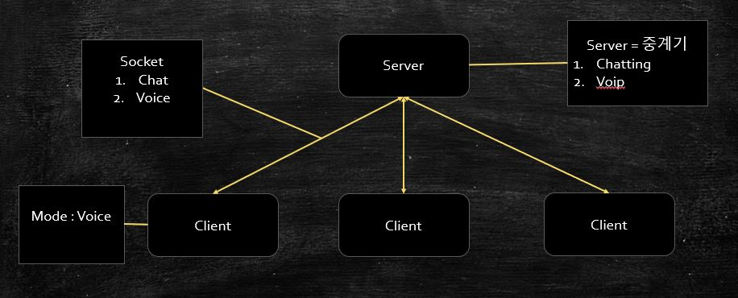
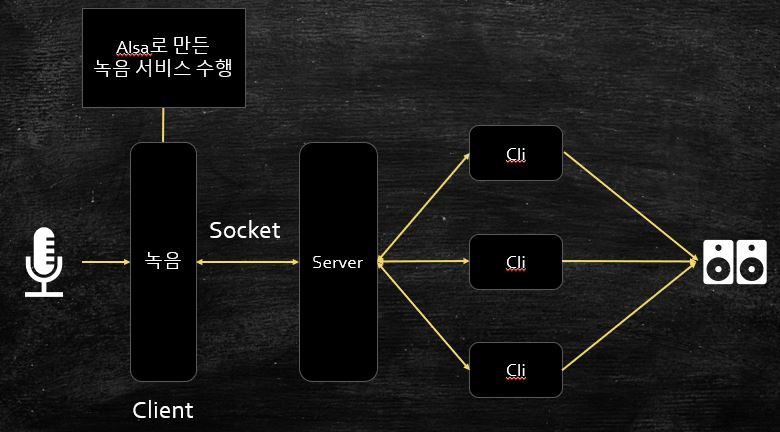

# 2020-2 시스템프로그래밍 개인 프로젝트
## **프로젝트 명**
- VOIP - Chatting Program
---
## **프로젝트 멤버 및 역할**
- 빅데이터 20185147 윤순상 - 개인 프로젝트
---
## **프로젝트 소개 및 개발 내용**
- Discord, Talk-On, Skype와 같은 음성 채팅 프로그램
- 이를 구현하기 위해 멀티미디어 프로그래밍(오디오 프로그래밍)을 학습
- OSS와 ALSA API를 이용해 사운드 프로그램을 구현하고
- 이 기능을 Chatting 프로그램에 UDP 프로토콜로 구현하여 추가 
---
## **프로젝트 개발 결과물 소개**

- Server : 중계기 역할, client들의 채팅내용을 전달하고 관리
- 또한 한 client가 녹음모드를 진행할 경우 녹음된 음성파일을 받아 전송하는 역할
- Client : 기본적인 채팅이 가능하며 <!v>와 같이 명령어로 모드를 변경해 음성을 녹화한 후 다른 player에게 전송할 수 있다.
- 다른 client는 음성파일을 받아 각자의 오디오 시스템으로 재생한다. 

---
## **개발 결과물을 사용하는 방법 소개**
- 미완성
- 멀티미디어 프로그래밍 학습에서 많은 어려움을 느낌...(독학의 한계?)
- 하지만 흥미가 있는 Topic이었고 관심이 가기에 시간이 나면 다시 도전할 생각...
---
## **개발 결과물의 필요성 및 활용방안**
- 현재도 VOIP 서비스를 제공하는 Chatting Program이 많다.
- 대표적으로 Discord가 정말 유명하고 많이 쓰이고 있다.
- 새로운 기능 및 품질 개선이 이루어지는 등 개발이 활발한 것으로 보인다.
- 게임을 하면서 자주 이용하는 사람으로써 매력적인 분야고 꾸준히 발전하고 있다고 생각한다.
---